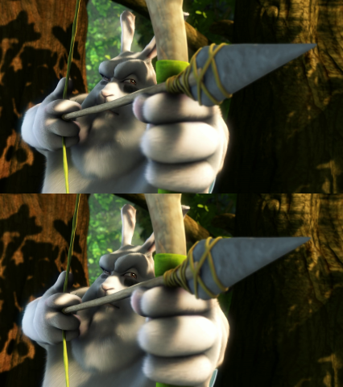

# SBS2RC
Converts a side-by-side 3d video into a red-cyan ([anaglyph](https://en.wikipedia.org/wiki/Anaglyph_3D)) video.

## Usage
```
python sbs2rc.py input.mp4
```

### Options
```
usage: sbs2rc.py [-h] [-o OUT] [-i] [-g] [-v] [-p {180,360}] [--method {ch,gr}] [--projmethod {cubemap,flat}] [--projinter {nearest,linear,cubic}] [--fov FOV] [--theta THETA] [--phi PHI] [--scale SCALE] [--switch] [--fourcc FOURCC] [--preview] [--noaudio] inputname

Converts a side-by-side 3D video to Anaglyph (red-cyan) video.

positional arguments:
  inputname             The filename of the input

optional arguments:
  -h, --help            show this help message and exit
  -o OUT, --out OUT     The filename of the output
  -i, --image           Assume an image input
  -g, --guess           Guess parameters from the filename. This will suppress -v and -p.
  -v, --vertical        Assume a vertically stacked format
  -p {180,360}, --project {180,360}
                        Project a 180 or 360 degree format (about twice slower). Assumes Equirectangular projection.
  --method {ch,gr}      Coloring method. default: ch <"ch": discard color channels that do not match.>, <"gr": set the image to grayscale then apply to the matching channels (left: red, right: cyan)>
  --projmethod {cubemap,flat}
                        Projection method. default: cubemap
  --projinter {nearest,linear,cubic}
                        Interpolation method for the projection. default: linear
  --fov FOV             FOV value used for --projmethod flat. default: 90
  --theta THETA         theta value used for --projmethod flat. default: 0
  --phi PHI             phi value used for --projmethod flat. default: 0
  --scale SCALE         Scale the input (%). default: 100
  --switch              Switch eyes.
  --fourcc FOURCC       The fourcc code of the output file. default: mp4v (if it doesn't work, try "XVID" with .avi)
  --preview             Show the output without saving
  --noaudio             Do not add the audio.
```

## Example


`python sbs2rc.py example_input.png -i -o example_output.png -v`


## Dependencies
- Python3
- OpenCV for python
- FFmpeg